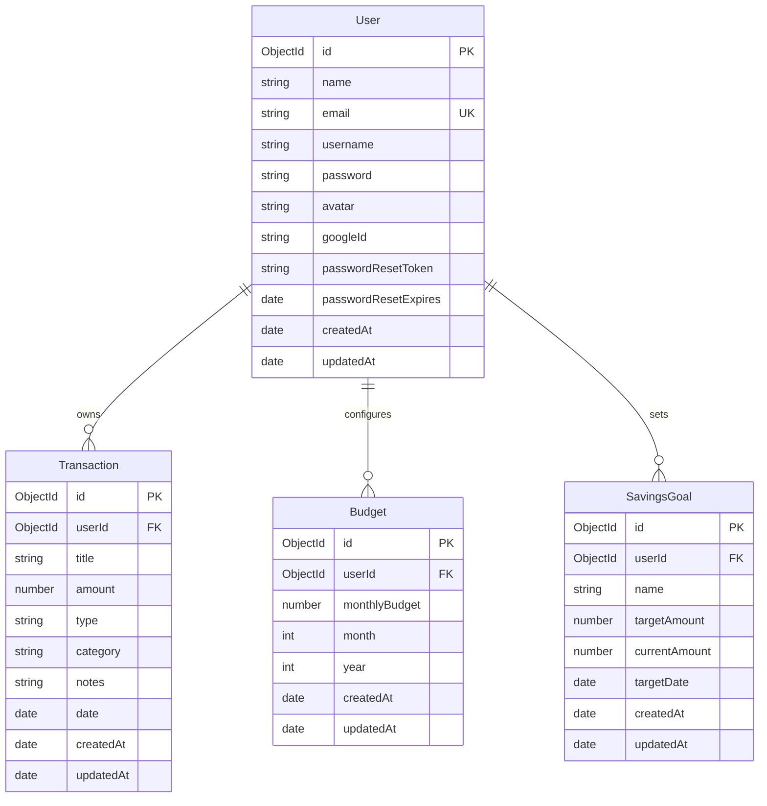

# Database Design Documentation

Finora uses MongoDB as its document-oriented database with Mongoose as the ODM. This document outlines the schema structure, data types, indexes, and relations configured for the database.

## Database Relationships

---

## Collections Specification

### 1. Users Collection (`users`)
Stores user profiles, credentials, and password reset tokens.

* **Schema**:
  - `name` (String, required, trimmed): User's full name.
  - `email` (String, required, unique, lowercase, trimmed): User's unique login email.
  - `username` (String, lowercase, trimmed): Custom handle for profiles.
  - `password` (String, select: false): Bcrypt hashed password. Excluded from query results by default for safety.
  - `avatar` (String, default: `""`): URL path to user's profile icon.
  - `googleId` (String, default: `""`): Unique identifier for Google OAuth sign-in.
  - `passwordResetToken` (String, select: false): Hashed reset token.
  - `passwordResetExpires` (Date, select: false): Expiration date for reset token.
  - `createdAt` (Date): Auto-managed timestamp.
  - `updatedAt` (Date): Auto-managed timestamp.

* **Indexes**:
  - `email`: 1 (Unique)

---

### 2. Transactions Collection (`transactions`)
Stores user income and expense records.

* **Schema**:
  - `userId` (ObjectId, ref: `"User"`, required): ID of the owner user.
  - `title` (String, required, trimmed): Title of the transaction.
  - `amount` (Number, required, min: 0): Transaction value.
  - `type` (String, required, enum: `["income", "expense"]`): Transaction type.
  - `category` (String, required, enum): Transaction categories, must be one of:
    `["Food", "Transport", "Shopping", "Bills", "Entertainment", "Health", "Education", "Investment", "Travel", "Salary", "Freelance", "Other"]`.
  - `notes` (String, default: `""`, trimmed): Additional user notes.
  - `date` (Date, required): Date when the transaction took place.
  - `createdAt` (Date): Auto-managed timestamp.
  - `updatedAt` (Date): Auto-managed timestamp.

* **Indexes**:
  - `userId`: 1
  - `{ userId: 1, date: -1 }`: Compound index for rapid sorting of user transactions by date.
  - `{ userId: 1, category: 1 }`: Compound index for rapid category filtering and aggregation query speeds.

---

### 3. Budgets Collection (`budgets`)
Stores monthly spending limits defined by users.

* **Schema**:
  - `userId` (ObjectId, ref: `"User"`, required): Owner identifier.
  - `monthlyBudget` (Number, required, min: 0): Target limit budget amount in currency units.
  - `month` (Number, required, min: 1, max: 12): Target month index.
  - `year` (Number, required): Target budget year.
  - `createdAt` (Date): Auto-managed timestamp.
  - `updatedAt` (Date): Auto-managed timestamp.

* **Indexes**:
  - `{ userId: 1, month: 1, year: 1 }`: Compound unique index. Ensures a user can only have one budget limit defined per calendar month.

---

### 4. Savings Goals Collection (`savingsgoals`)
Stores financial saving targets.

* **Schema**:
  - `userId` (ObjectId, ref: `"User"`, required): Owner identifier.
  - `name` (String, required, trimmed): Goal label (e.g. "Emergency Fund").
  - `targetAmount` (Number, required, min: 0): Total cash amount target.
  - `currentAmount` (Number, required, min: 0, default: 0): Amount saved so far.
  - `targetDate` (Date): Expected deadline date.
  - `createdAt` (Date): Auto-managed timestamp.
  - `updatedAt` (Date): Auto-managed timestamp.

* **Indexes**:
  - `userId`: 1
  - `{ userId: 1, createdAt: -1 }`: Compound index for listing savings goals in reverse chronological order.
